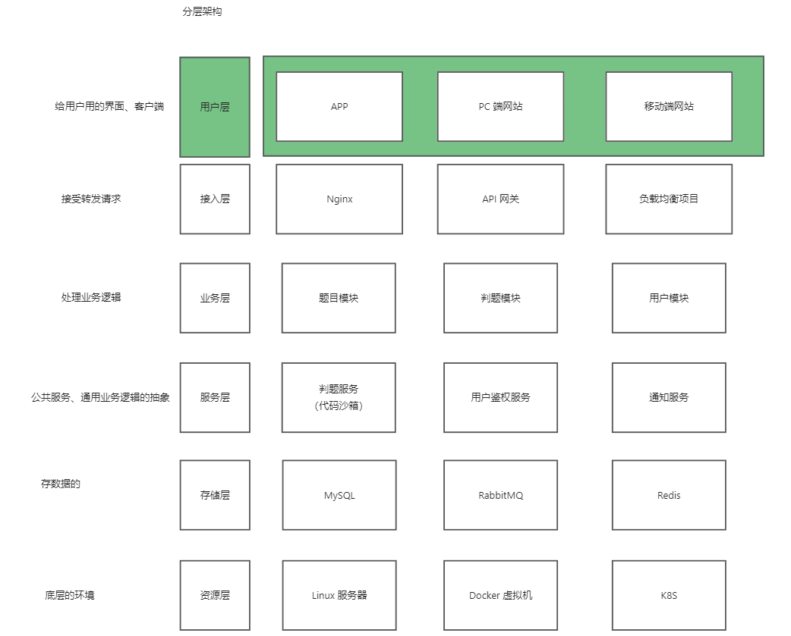
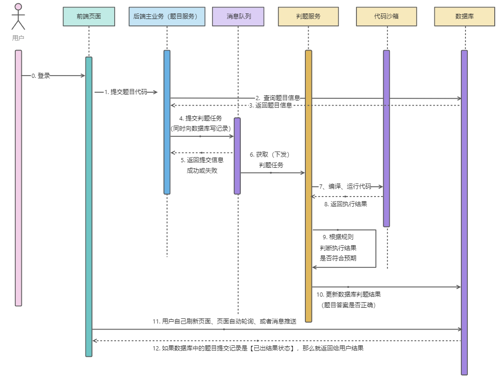

# ac-oj-backend-microservice

## 技术选型

- 前端：Vue3、Arco Design 组件库、手撸项目模板、在线代码编辑器、在线文档浏览
- Java进程控制、Java 安全管理器、部分 JVM 知识点
- 虚拟机（云服务器）、Docker（代码沙箱实现）
- Spring Cloud 微服务 、消息队列、多种设计模式

## 架构设计

## 核心业务流程

## 主要功能

1. 题目模块
    1. 创建题目（管理员）
    2. 删除题目（管理员）
    3. 修改题目（管理员）
    4. 搜索题目（用户）
    5. 在线做题
    6. 提交题目代码
2. 用户模块
    1. 注册
    2. 登录
3. 判题模块
    1. 提交判题（结果是否正确与错误）
    2. 错误处理（内存溢出、安全性、超时）
    3. 自主实现 代码沙箱（安全沙箱）
    4. 开放接口（提供一个独立的新服务）
